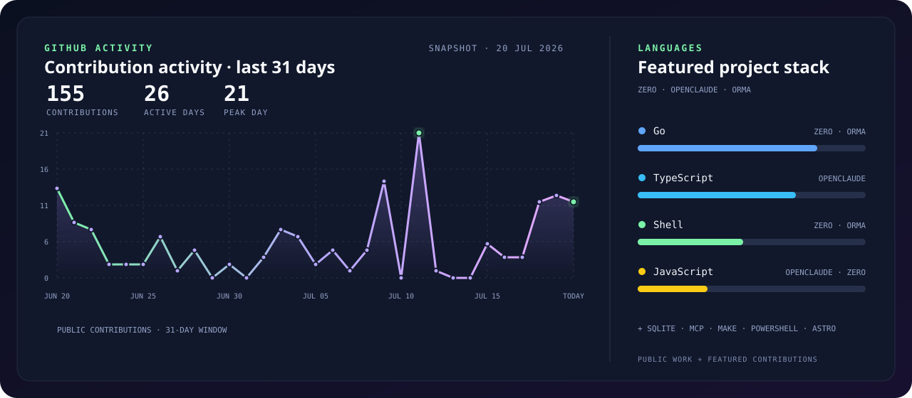

  

<h1 align="center">ANANDAN / A8X</h1>

  Building small, powerful worlds for developer tools, terminals, and coding agents.

  <a href="https://github.com/Gitlawb/zero"><b>Zero</b> · core contributor</a>
  &nbsp;&nbsp;↗&nbsp;&nbsp;
  <a href="https://github.com/Gitlawb/openclaude"><b>OpenClaude</b> · contributor, 21 commits</a>
  &nbsp;&nbsp;↗&nbsp;&nbsp;
  <a href="https://github.com/anandh8x/orma"><b>Orma</b> · local memory for terminal work</a>

Local first. Terminal native. Human in the loop.

  

