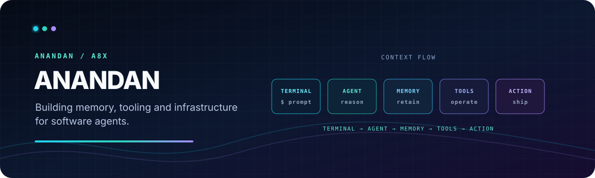

  

  
  

## Hey, I’m Anandan 👋

I build developer tools and local-first systems for people who spend their day in the terminal. I’m interested in useful automation, thoughtful agent workflows, and software that stays understandable as it grows.

> **Now:** shaping [Orma](https://github.com/anandh8x/orma), an offline operational memory for terminal users and the coding agents that work alongside them.

> **Core contributor:** [Zero](https://github.com/Gitlawb/zero), a customizable coding agent built around your model, machine, and rules.

## What I work with

  
  
  
  

## Selected work

| Project | What it is | Built with |
| --- | --- | --- |
| [Zero](https://github.com/Gitlawb/zero) | A customizable, terminal-native coding agent that answers to your model, machine, and rules. **Core contributor.** | Go · Shell · MCP |
| [Orma](https://github.com/anandh8x/orma) | Local, privacy-first operational memory for terminal workflows and coding agents. | Go · SQLite · local embeddings |
| [openclaude](https://github.com/anandh8x/openclaude) | A fork used to explore an open-source, multi-model coding-agent CLI. | TypeScript |

## How I like to build

- **Local first** — your workflows and context should remain yours.
- **Terminal native** — fast, composable tools beat unnecessary ceremony.
- **Agent aware** — automation should preserve the reasoning that made it useful.

## Find me here

 

Make the tools around you a little more capable every day.

